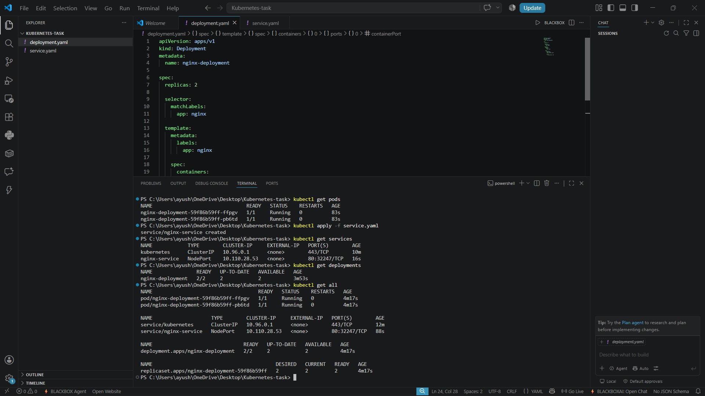
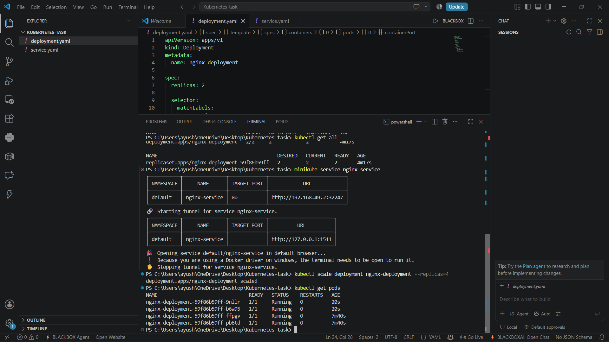
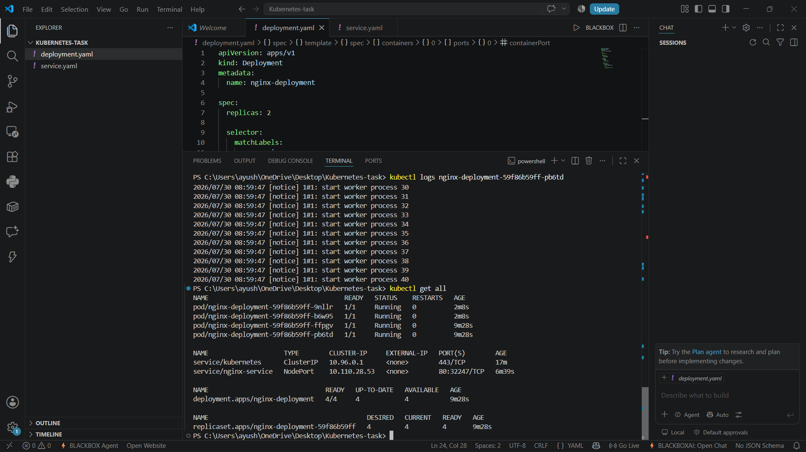

# Kubernetes Cluster Setup with Minikube

## Overview

This project demonstrates the basics of Kubernetes by creating a local Kubernetes cluster using Minikube. The application is deployed using a Deployment resource and exposed through a Service. The deployment is then scaled to multiple replicas to understand how Kubernetes manages applications.

## Tools Used

- Minikube
- Kubernetes (kubectl)
- Docker
- Visual Studio Code
- Git & GitHub

## Project Files

```
kubernetes-task/
│── deployment.yaml
│── service.yaml
│── README.md
└── screenshots/
    ├── kubectl-get-pods-services.png
    ├── scaled-deployment.png
    └── kubectl-get-all.png
```

## Steps Performed

1. Installed and configured Minikube and kubectl.
2. Started a local Kubernetes cluster using Docker as the driver.
3. Created a Deployment for the Nginx application.
4. Applied the deployment using kubectl.
5. Verified that the pods were running successfully.
6. Created a Service to expose the application.
7. Verified the service using kubectl.
8. Accessed the application through Minikube.
9. Scaled the deployment from 2 replicas to 4 replicas.
10. Checked the deployment status and available Kubernetes resources.

## Deployment

Apply the deployment:

```bash
kubectl apply -f deployment.yaml
```

Verify the pods:

```bash
kubectl get pods
```

## Service

Create the service:

```bash
kubectl apply -f service.yaml
```

Verify the service:

```bash
kubectl get services
```

Access the application:

```bash
minikube service nginx-service
```

## Scaling the Deployment

Increase the number of replicas:

```bash
kubectl scale deployment nginx-deployment --replicas=4
```

Verify the updated pods:

```bash
kubectl get pods
```

## Useful Commands

```bash
kubectl get pods
kubectl get services
kubectl get deployments
kubectl get all
kubectl describe deployment nginx-deployment
kubectl logs <pod-name>
minikube status
```

## Screenshots

### Running Pods and kubernetes Services


### Deployment After Scaling


### All Kubernetes Resources


## What I Learned

Working on this project helped me understand the basic building blocks of Kubernetes, including Pods, Deployments, and Services. I also learned how to manage applications using `kubectl`, expose services, and scale deployments with just a few commands. Setting up a local cluster using Minikube provided hands-on experience with Kubernetes in a development environment.

## Author

**Ayush Mankar**
